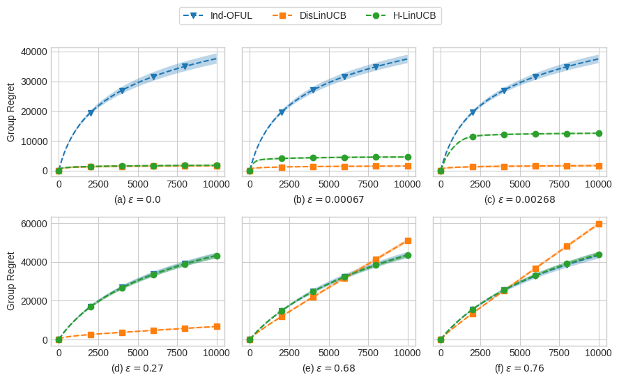

# Multi-agent Learning in Heterogeneous Linear Contextual Bandit (NeurIPS 2023).

Please run `./run.sh` to generate the figure in the paper, this script runs on a cluster with 30 cores CPU.
## Simulation results:

## Paper citation

